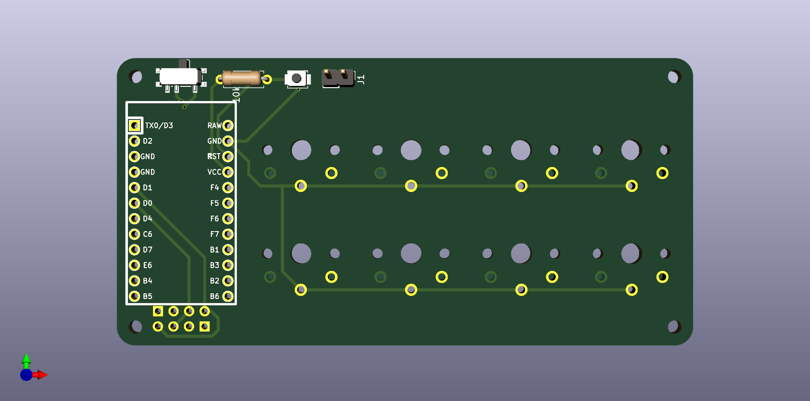

# Paintbrush Version 1

This is the initial hardware design of the Paintbrush mini keyboard. This was our first attempt at a hardware design and it's pretty good.

Fortunately we though of some updates and ideas ahead of the initial prototypes being ordered.

This version of the hardware was **NEVER** actually built or tested. Unless you really want to use this design, we recommend skipping straight to version 2.

