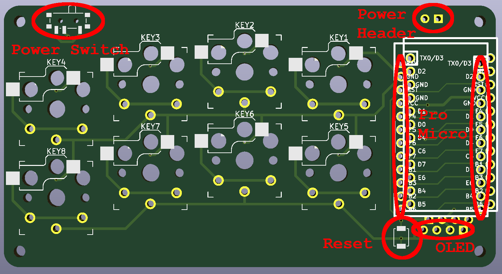
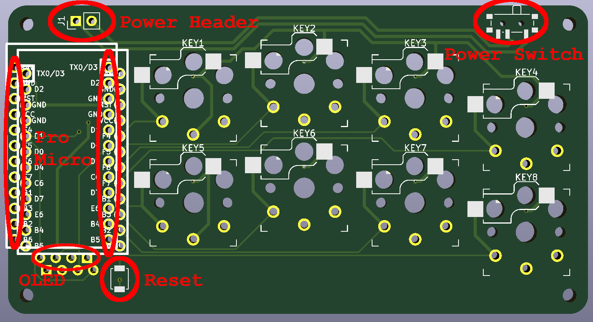

# Paintbrush Version 4

This is the fourth hardware design of the Paintbrush mini keyboard. This version removes the 'leg' from version 3 and moves the secondary features (switch/reset button) to a more user friendly location at the top of the board.

Please see the following sections for details about this hardware version.

## Rendering

## Features

- *Reversable* PCB
  - Can be built left *OR* right handed
- Pro Micro compatible MCU foot print
- Kalih Choc v1 mechanical switches
  - Soldered directly *OR* using kalih hot swap sockets
- OLED support (optional)
- Slide switch that can be used as a power switch (optional)
- Reset button (optional)
- Bottom plate (optional)

## Bill of Materials

Please note: the provided links are for reference. Most of these products can be found in more than one store.

| Component | Part Information | Quantity | Purchase |
| --------- | ---------------- | -------- | -------- |
| Pro Micro MCU | Any pro micro compatible MCU that supports ZMK or QMK | 1 | N/A |
| Kalih Choc v1 Switches | Kailh low profile Switch 1350 Chocolate Keyboard Switch | 8 | [AliExpress](https://www.aliexpress.com/item/32959996455.html) |
| Kalih Hot Swap Sockets (optional if directly soldering switches) | Kailh hot swap Socket for low profile 1350 Chocolate Switches | 8 | [AliExpress](https://www.aliexpress.com/item/33023283633.html) |
| Optional OLED | Any SSD1306 I2C OLED supported by or ZMK | 1 | N/A |
| Optional Power Switch | C&K PCM12SMTR | 1 | [DigiKey](https://www.digikey.com/en/products/detail/c-k/PCM12SMTR/1640112?s=N4IgTCBcDaIAoGECyBGCBdAvkA) |
| Optional Reset button | Omron Electronics Inc-EMC Div B3U-1000P | 1 | [DigiKey](https://www.digikey.com/en/products/detail/omron-electronics-inc-emc-div/B3U-1000P/1534338) |
| Optional Bottom Plate | The bottom plate for the PCB, attach with M2 stand offs and screws | 1 | N/A |
| Optional M2 stand offs | Stand offs can be used to attach the bottom plate or add a mild angle to the obard | 2-4 | N/A |
| Optional Battery | A *lithium* battery for powering the board, we recommend 10440 or lithium polymer batteries | 1 | N/A |

## Bottom Plate

The bottom plate is wholly optional for this build. We strongly recommend including it as part of your PCB order or 3d printing it in [PA12](https://www.shapeways.com/materials/multi-jet-fusion-pa12/) or [PA12-GB](https://www.shapeways.com/materials/multi-jet-fusion-pa12gb/) at [ShapeWays](https://www.shapeways.com/) if you want a bottom plate.

The bottom plate is available as a [step file](small-paintbrush-hotswap-bottom.step) if you'd like to have it created via CNC or 3d printing independent of your PCB order.

The bottom plate can be attached using standard M2 stand offs and screws.

## Build Instructions

1. Solder hot swap sockets if being used
    - Please note: the sockets are soldered to the **underside** of the PCB
1. Solder power switch if being used
1. Solder reset button if being used
1. Solder switches if *NOT* using hot swap sockets
1. Solder pro micro compatible mcu
1. Solder OLED if being used
1. Solder one pad of power header to appropriate pro micro pin if being used
1. Solder battery to power header (if being used) and ground
1. Populate switches if using hot swap sockets
1. Flash chosen firmware

## Soldering Quick References

### Left Handed Builds

### Right Handed Builds

